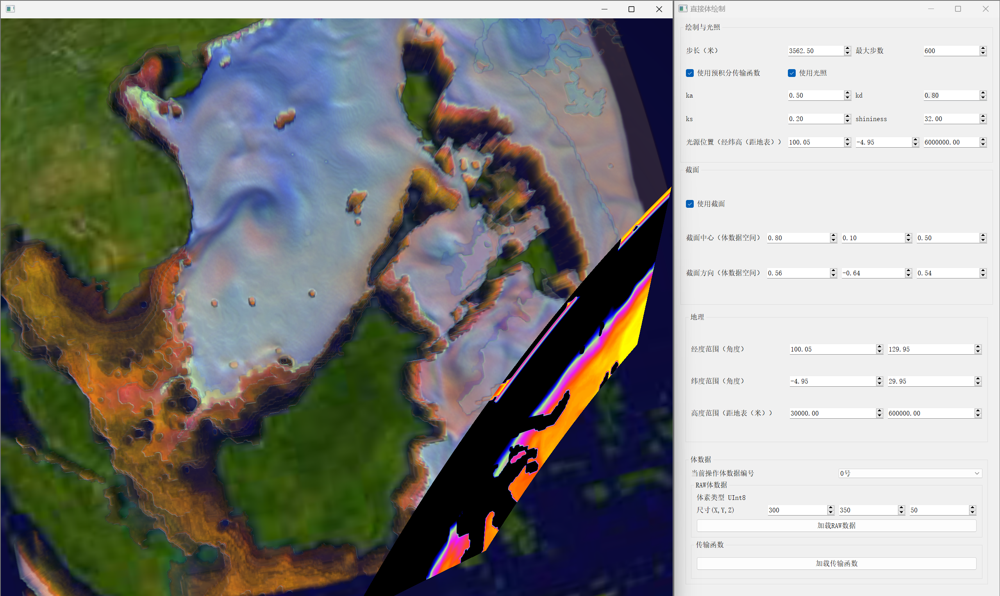

# VIS on Earth for Qt x OSG

## 介绍

项目旨在在Qt x OSG平台上实现面向地球的可视化功能（主要面向科学可视化）。

项目利用Qt的动态反射功能，将Qt的UI控件直接映射到OSG的Uniform（见[reflectable.h](./vis4earth/reflectable.h)和[qt_osg_reflectable.h](./vis4earth/qt_osg_reflectable.h)），去除了中间层，简化了各种业务代码。使用方式举例如下：

- UI控件需命名为 `<控件类型>_<成员名>_<成员类型>_VIS4EarthReflectable`
- 继承 `QtOSGReflectableWidget` 并写代码如下：

```cpp
// dvr.h

namespace Ui {
class DirectVolumeRenderer;
}

class DirectVolumeRenderer : public QtOSGReflectableWidget {
    Q_OBJECT

  public:
    DirectVolumeRenderer(QWidget *parent = nullptr) : QtOSGReflectableWidget(ui, parent) {
        // ...
        for (auto obj : std::array<QtOSGReflectableWidget *, 3>{this, &geoCmpt, &volCmpt})
            obj->ForEachProperty([&](const std::string &name, const Property &prop) {
                    stateSet->addUniform(prop.GetUniform());
        });
    }
  private:
    Ui::DirectVolumeRenderer *ui;
    osg::ref_ptr<osg::ShapeDrawable> sphere;
    // ...
};
```

使用对象-组件模式（Object-Component）构建UI。使用方式举例如下：

```cpp
// dvr.h

class DirectVolumeRenderer : public QtOSGReflectableWidget {
    Q_OBJECT

  public:
    DirectVolumeRenderer(QWidget *parent = nullptr);
  private:
    // ...
    GeographicsComponent geoCmpt;
    VolumeComponent volCmpt;
};
```

```cpp
// components_ui_export.h

#include <ui_geographics_cmpt.h>
#include <ui_volume_cmpt.h>
```

```cpp
// dvr.cpp

/*
* Hack，避免Qt报xxx.ui与xxx.cpp不在同一目录的错误。不能直接写：
* #include <ui_geographics_cmpt.h>
* #include <ui_volume_cmpt.h>
*/
#include <vis4earth/components_ui_export.h>

DirectVolumeRenderer::DirectVolumeRenderer(QWidget *parent = nullptr)
 : QtOSGReflectableWidget(ui, parent) {
    ui->scrollAreaWidgetContents_main->layout()->addWidget(&geoCmpt);
    ui->scrollAreaWidgetContents_main->layout()->addWidget(&volCmpt);
    // ...
    connect(geoCmpt.GetUI()->doubleSpinBox_heightMax_float_VIS4EarthReflectable,
            QOverload<double>::of(&QDoubleSpinBox::valueChanged), onHeightChanged);
    // ...
}
```

## 经过测试的依赖

- C++ 11
- Qt 5.12
- OSG 3.6.5

## 功能

- [x] 传输函数调节
- [x] 直接体绘制
- [x] 直接体绘制（截面）
- [x] 直接体绘制（时序数据）
- [x] 直接体绘制（基于传输函数的多体混合绘制）
- [x] 直接体绘制（预积分传输函数）
- [x] 直接体绘制（Blinn-Phong局部光照）
- [x] Marching Cube 等值面绘制
- [x] Marching Square 等值线绘制

## 展示

- 直接体绘制（截面+预积分传输函数+Blinn-Phong）



## 编码规范

- 代码格式由`.clangformat`自动控制。使用Visual Sutiod的情况下，建议安装`Format on Svae`扩展，并将编码格式设置为`UTF8 with BOM`，以在国产环境下正确浏览注释。
- C++规范
  - 标准为C++ 11，已在`CMake`中约束
  - 类`public`属性和函数采用大写开头的驼峰命名
  - 类`protected`、`private`属性和函数采用小写开头的驼峰命名
  - 头文件包含采用`ifndef`法，不采用`#pragma once`法
    - 头文件标识宏应与所在相对路径统一。如`vis4earth/scalar_viser/heatmap.h`对应下段代码
  - `lambda`函数需要指定返回值，否则在国产环境下可能无法由编译器自动推导出来

```cpp
#ifndef VIS4EARTH_SCALAR_VISER_HEATMAP_H

auto lambda = []() -> RetType {
  // ...
};
```
