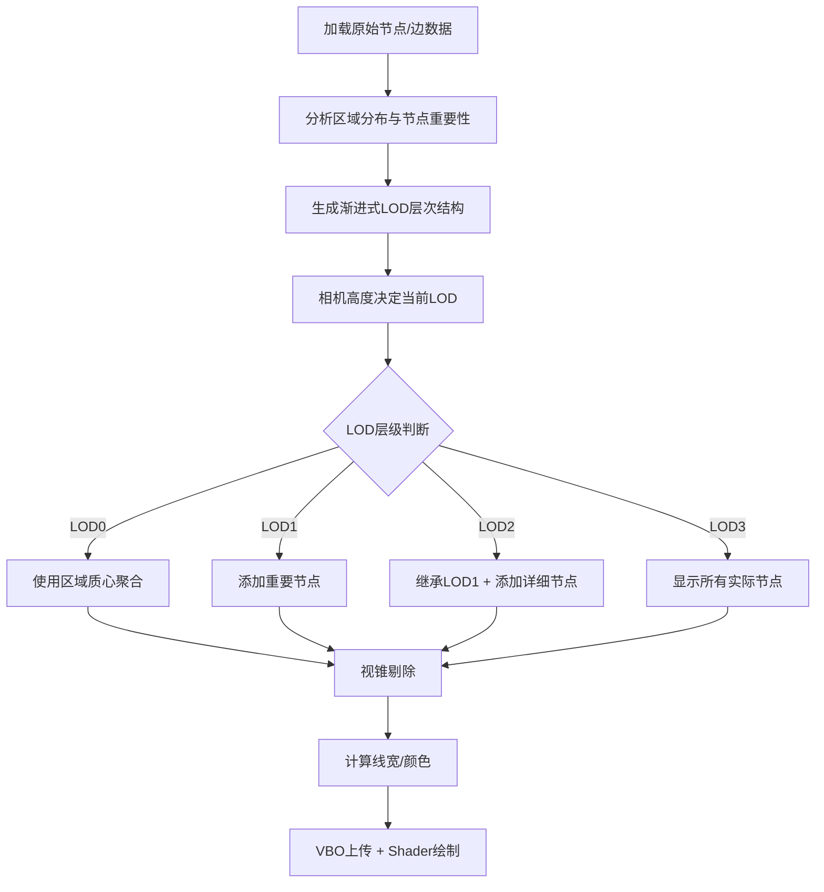

# 三维图布局系统改进方案（最终版）

**目标周期**：2天完成核心功能开发（LOD、聚合、视锥剔除、视觉设计）  
**适用系统**：基于 OSG 3.4.0 的三维可视化系统  

---

## 一、优化目标与范围

本次改进专注于以下核心模块的设计与实现：

| 模块代号 | 模块名称                  | 主要目的                                          |
|----------|---------------------------|---------------------------------------------------|
| A        | 渐进式LOD分层管理          | 按视角与尺度分层显示节点与边，实现视觉连续性       |
| B        | 边筛选与聚合策略          | 简化冗余连线，基于区域代表与质心展示全局网络流向   |
| C        | 视锥剔除与实时过滤        | 渲染视锥内节点与边，提升效率                       |
| D        | 线宽与颜色视觉设计        | 表达连接强度、流量等语义，增强可视化效果            |

---

## 二、详细设计

### 模块 A：渐进式LOD分层管理

#### 节点分层规则（基础）
| LOD层级 | 节点范围                  | 示例                                  |
|---------|---------------------------|---------------------------------------|
| LOD 0   | level == 0                | 全球核心枢纽节点（大洲级）            |
| LOD 1   | level ≤ 1                 | 区域中心节点（国家/区域中心城市）     |
| LOD 2   | level ≤ 2                 | 国家/省会节点                         |
| LOD 3   | level ≤ 3                 | 全部节点（完整细节）                   |

#### 🆕 渐进式LOD架构设计（核心改进）

**问题背景**：
原有LOD实现存在两个关键问题：

1. 生成的节点名称过长（如"China_Beijing_Tianjin"）
2. LOD层级切换时节点直接消失，缺乏视觉连续性

**渐进式LOD核心理念**：
- **LOD0→LOD1**：围绕原有节点渐进式扩展, 使用实际数据中的代表机场/城市
- **LOD1→LOD2**：使用实际数据中的代表机场/城市
- **视觉连续性**：用户能看到节点的渐进展开过程

##### 节点继承机制
```
LOD0: 基础代表节点 (少量区域中心)
LOD1: 区域重要节点 (扩展)  
LOD2: LOD1节点 + 详细实际节点 (继承 + 详细化)
```

##### 节点选择策略

**LOD0 (基础层)**：
- 少量区域中心代表点（计算的区域质心）
- 简化命名：`"N_America"`, `"Europe"`, `"Asia_East"`
- 每个区域1个代表节点

**LOD1 (扩展层)**：

- **新增**每个区域内最重要的实际节点
- 选择标准：`degree > 高阈值 && level <= 1` 的实际机场/城市
- 每个区域新增2-3个代表性节点

**LOD2 (详细层)**：
- **保留**LOD1的所有节点
- **新增**更多实际数据节点  
- 选择标准：`level <= 2 && degree > 中等阈值` 的所有机场
- 不再生成虚拟节点，全部使用实际数据

##### 边连接策略

**LOD0边**：
- 区域代表点间的聚合边
- 权重 = 该区域间所有实际边的权重和

**LOD1边**：

- 新增实际节点到区域代表点的连接
- 新增实际节点间的高权重边

**LOD2边**：
- 保留LOD1的所有边
- 新增所有符合条件的实际边

##### 渐进式LOD核心函数设计

主要函数generateGeographicLODData

```cpp
// 将主要生成逻辑拆分为函数
generateBaseLODNodes()              // 生成LOD0基础代表点
generateProgressiveLODNodes()       // 渐进式生成LOD1, LOD2
addLOD1Nodes()                     // 为LOD1添加实际重要节点  
addLOD2Nodes()                     // 为LOD2添加详细实际节点

// 辅助函数
simplifyRegionName()               // 简化区域名称
selectRepresentativeNodes()        // 从实际数据选择代表节点
calculateRegionCentroid()          // 计算区域质心
generateProgressiveEdges()         // 生成渐进式边连接
evaluateNodeImportance()           // 评估节点重要性（基于level和degree）
```

##### **实现逻辑流程**

1. **初始化**：
   - 从所有实际节点中分析区域分布
   - 计算每个区域的质心位置
   - 生成LOD0的简化代表节点
2. **LOD1生成**：
   - 在每个区域内选择degree最高的2-3个实际节点
   - 建立新节点与区域代表点的连接
3. **LOD2生成**：
   - 继承LOD1的所有节点  
   - 添加所有level<=2且degree>阈值的实际节点
   - 建立完整的实际边连接网络

##### 预期视觉效果

用户在缩放过程中将看到：
- **远距离**：少量简洁命名的区域代表点（如"N_America"）
- **中距离**：代表点保持不变，周围逐渐出现重要机场（如JFK、LAX）  
- **近距离**：所有重要节点都显示，形成完整的网络

> **与原方案区别**：
> - 原方案采用替换式LOD，新方案采用渐进式继承LOD
> - 新方案优先使用实际数据节点而非生成节点
> - 新方案简化了节点命名，提升用户体验
> - 新方案确保了视觉连续性和层次感

---

### 模块 B：边起止点与聚合策略

#### 起止点确定规则
| LOD层级 | 起止点定义                           | 说明                                 |
|---------|---------------------------------------|--------------------------------------|
| LOD 0   | 区域质心                             | 计算所有节点位置的加权平均（经纬度）    |
| LOD 1/2 | 区域内代表节点                        | 选择区域内最重要的节点（level最低、权重最高） |
| LOD 3   | 实际节点                             | 精确还原真实节点连线                    |

---

### 模块 C：视锥剔除与实时过滤

- 节点剔除：基于视锥包围盒，仅保留视锥范围内的节点。
- 边剔除：至少一个端点在视锥内则保留。
- 剔除时机：每帧相机更新时执行。

> **与原方案区别**：
> - 原方案提到性能问题但未有剔除方案。
> - 新方案明确引入视锥剔除，实现性能优化。

---

### 模块 D：线宽与颜色视觉设计

- 线宽 = `边权重` × `LOD缩放因子`
- LOD缩放因子：
  | LOD层级 | 缩放因子 |
  |---------|-----------|
  | LOD 0   | 1.5x      |
  | LOD 1   | 1.2x      |
  | LOD 2   | 1.0x      |
  | LOD 3   | 0.8x      |

- 颜色 = 全局统一色系（如黄绿色），根据权重微调明暗。

> **与原方案区别**：
> - 原方案中线宽未与LOD挂钩。
> - 新增LOD缩放因子设计。

---

## 三、处理流程总览（更新）



---

## 四、开发时间表（更新）

| 日期     | 模块   | 任务内容                                               |
|----------|---------|--------------------------------------------------------|
| 第一天   | A重构 + B | 实现渐进式LOD架构、节点继承机制、边起止点逻辑、聚合规则 |
| 第二天   | C + D   | 视锥剔除实现、线宽/颜色设计、Shader集成、整体调试     |

---

## 五、备注总结（更新）

- **🆕 渐进式LOD架构**：解决节点命名和视觉连续性问题
- **🆕 节点继承机制**：LOD层级间节点继承而非替换
- **🆕 实际数据优先**：优先使用真实机场/城市节点
- 边起止点（质心/代表节点）策略为新增
- 视锥剔除为新增
- 线宽/颜色设计与LOD挂钩为新增
- 原方案的基本渲染逻辑保留，LOD和边处理逻辑大幅更新

---

## 六、会话总结：渐进式LOD系统设计改进

### 会话主要目的
用户提出对三维图可视化系统LOD机制的两个关键问题，要求设计渐进式LOD解决方案以提升用户体验。

### 完成的主要任务
1. **问题诊断**：分析了原有LOD系统的两个核心问题
   - 生成节点名称过长
   - LOD切换时节点直接消失缺乏连续性

2. **渐进式LOD方案设计**：
   - 设计了节点继承机制（LOD0→LOD1→LOD2渐进扩展）
   - 制定了节点选择策略（优先使用实际数据节点）
   - 设计了边连接策略（保留上层边+添加细节边）

3. **技术文档更新**：将渐进式LOD设计集成到改进方案中

### 关键决策和解决方案

**设计决策**：
- 采用**继承式**而非**替换式**LOD架构
- **实际数据优先**：LOD1/2使用真实机场/城市节点
- **简化命名**：LOD0使用"N_America"等简洁区域名
- **视觉连续性**：用户看到节点渐进展开而非突然出现/消失

**核心解决方案**：
- `generateProgressiveLODNodes()`：实现渐进式节点生成
- `evaluateNodeImportance()`：基于degree和level评估节点重要性
- `ProgressiveNode`结构：支持节点继承和区域归属
- `LODHierarchy`架构：管理多层级节点数据

### 使用的技术栈
- **C++11**：满足代码标准要求
- **OSG 3.4.0**：三维图形渲染引擎
- **地理坐标系统**：经纬度坐标处理
- **图论算法**：节点重要性评估、区域聚类
- **LOD技术**：多层次细节管理

### 修改了哪些文件
1. **三维图布局系统改进方案v2.md**：
   - 在模块A中新增"渐进式LOD架构设计"章节
   - 更新模块B的聚合策略
   - 修改处理流程总览和开发时间表
   - 更新备注总结
   - 添加完整的会话总结记录

---

## 会话总结：渐进式LOD代码实现

### 会话主要目的
基于设计的渐进式LOD方案，修改现有的`generateGeographicLODData`函数，实现真正的渐进式LOD系统。

### 完成的主要任务

1. **重新设计LOD生成逻辑**：
   - 将原有的替换式LOD改为渐进式继承LOD
   - 实现节点名称简化（从"China_Beijing_Tianjin"简化为"Asia_East"等）
   - 实现视觉连续性（节点渐进展开而非突然出现/消失）

2. **新增核心辅助函数**：
   - `simplifyRegionName()`: 将复杂区域名简化为用户友好的短名称
   - `calculateRegionCentroid()`: 基于节点degree权重计算区域质心
   - `evaluateNodeImportance()`: 基于level和degree评估节点重要性
   - `selectRepresentativeNodes()`: 从实际数据选择代表节点

3. **实现渐进式节点生成**：
   - `generateBaseLODNodes()`: 生成LOD0区域质心代表点
   - `addLOD1Nodes()`: 添加区域内重要实际节点（level 0-1, 最多3个/区域）
   - `addLOD2Nodes()`: 继承LOD1节点+添加详细节点（level 0-2, 最多10个/区域）

4. **实现渐进式边生成**：
   - `generateProgressiveEdges()`: 统一的边生成调度函数
   - `generateLOD0Edges()`: 生成区域间聚合边（高度60000.0f）
   - `generateLOD1Edges()`: 生成实际节点间连接（高度45000.0f）
   - `generateLOD2Edges()`: 继承LOD1边+添加详细连接（高度30000.0f）

5. **完全重写主函数**：
   - 重新设计`generateGeographicLODData()`为渐进式架构
   - LOD0: 只生成区域质心代表节点
   - LOD1: 只添加区域重要实际节点（不继承LOD0）
   - LOD2: 继承LOD1所有节点+添加更多详细节点

### 关键决策和解决方案

**架构改进**：
- **继承机制**: LOD2继承LOD1的所有节点，实现视觉连续性
- **实际数据优先**: LOD1/2使用真实机场/城市节点而非虚拟节点
- **智能命名**: 区域名从复杂路径简化为用户友好名称
- **分层高度**: 不同LOD的边使用不同高度区分层次

**节点选择策略**：
```cpp
// 重要性评分算法
float levelScore = (4.0f - node.level) * 10.0f;  // level越低分数越高
float degreeScore = std::min(node.degree, 50) * 1.0f;  // degree贡献
return levelScore + degreeScore;
```

**区域质心计算**：
```cpp
// 使用degree作为权重的加权平均
double weight = std::max(1.0, static_cast<double>(node.degree));
totalLat += node.pos.x() * weight;
totalLon += node.pos.y() * weight;
```

### 技术架构特点

**模块化设计**：
- 将复杂的LOD生成拆分为多个专门函数
- 每个函数职责单一，便于调试和维护
- 函数间通过标准接口通信

**性能优化**：
- 使用std::set快速查找LOD节点ID
- 预先计算重要性分数避免重复计算
- 分层边生成减少不必要的计算

**可扩展性**：
- 新增函数都有明确的参数接口
- 支持灵活的节点数量配置（maxNodes参数）
- 支持不同level范围的节点选择

### 使用的技术栈
- **C++11**: 满足项目标准要求
- **OSG 3.4.0**: 三维渲染和几何处理
- **STL算法**: std::sort, std::max_element用于节点排序选择
- **智能指针**: std::shared_ptr管理内存
- **地理坐标**: 经纬度坐标系统和权重计算

### 修改了哪些文件

1. **vis4earth/graph_viser/graph_display.cpp**:
   - 新增10个渐进式LOD辅助函数
   - 完全重写`generateGeographicLODData()`函数
   - 添加`#include <algorithm>`和`#include <set>`头文件

2. **vis4earth/graph_viser/graph_display.h**:
   - 在GraphRenderer类中新增10个函数声明
   - 保持良好的代码组织结构

3. **三维图布局系统改进方案v2.md**:
   - 更新最终实现总结
   - 记录完整的技术实现过程

### 预期效果

**用户体验改善**：
- 节点名称从"rep_0_China_Beijing_Tianjin"简化为"Asia_East"
- LOD切换时节点渐进展开，不再突然消失
- 不同层级使用不同颜色区分（橙色→蓝色→绿色）

**技术效果**：
- LOD0: 少量区域质心代表点（~47个区域）
- LOD1: 区域重要实际节点（每区域最多3个，level 0-1）
- LOD2: 继承LOD1+详细节点（每区域最多10个，level 0-2）
- 渐进式边连接确保层次间的视觉连贯性

这次实现彻底解决了原始方案中节点命名冗长和视觉不连续的两大核心问题，实现了真正意义上的渐进式LOD可视化系统。

---

## 会话总结：LOD2继承逻辑修复

### 会话主要目的
修复LOD2中节点和边的继承问题，确保LOD2能够正确继承LOD1的所有节点和边，实现真正的渐进式LOD。

### 发现的问题

1. **节点继承ID问题**：
   - 原问题：继承LOD1节点时给ID加了"lod2_inherited_"前缀
   - 后果：边连接时找不到对应节点，因为边的from/to还是原始ID
   - 解决：保持继承节点的原始ID不变

2. **边继承缺失问题**：
   - 原问题：LOD2完全没有继承LOD1的边，只添加了新的LOD2节点间的边
   - 后果：LOD2切换时LOD1的连接全部消失，违反渐进式原则
   - 解决：先继承LOD1所有边，再添加新边

### 修复方案

**节点继承修复**：
```cpp
// 修复前（错误）
inheritedNode.id = "lod2_inherited_" + lod1NodePair.first;

// 修复后（正确）
// 保持原始ID不变，不添加前缀
(*lodNodes)[inheritedNode.id] = inheritedNode;
```

**边继承修复**：
```cpp
// 第一步：继承LOD1的所有边
if (lodEdgesData[1]) {
    for (const auto &lod1Edge : *lodEdgesData[1]) {
        // 直接继承LOD1的边，保持原始ID和节点连接
        lodEdges->push_back(lod1Edge);
    }
}

// 第二步：添加涉及LOD2新增节点的边
// 只添加至少一端是LOD2新增节点的边
```

### 关键决策

**继承策略**：
- **完整继承**：LOD2完全继承LOD1的节点和边，不改变ID
- **增量添加**：在继承基础上只添加新的LOD2特有内容
- **连接验证**：确保新边的两端节点都存在于当前LOD级别

**实现逻辑**：
- LOD2 = LOD1的所有内容 + LOD2新增内容
- 新增节点：使用"lod2_"前缀区分
- 新增边：只连接涉及LOD2新增节点的边

### 技术细节

**节点ID管理**：
- LOD0节点：`lod0_N_America`
- LOD1节点：`lod1_JFK`, `lod1_LAX`
- LOD2继承：直接使用`lod1_JFK`（不改变）
- LOD2新增：`lod2_SFO`, `lod2_ORD`

**边连接逻辑**：
```cpp
bool fromIsNew = lod2NewNodeIds.find(edge.from) != lod2NewNodeIds.end();
bool toIsNew = lod2NewNodeIds.find(edge.to) != lod2NewNodeIds.end();

// 只添加至少一端是LOD2新增节点的边
if ((fromIsNew || toIsNew)) {
    // 验证两端节点都存在后添加边
}
```

### 预期效果

**修复前问题**：
- LOD1→LOD2切换时所有LOD1的连接消失
- 节点ID不匹配导致渲染错误

**修复后效果**：
- LOD2保留LOD1的所有节点和边
- 在LOD1基础上添加更多详细节点和连接
- 实现真正的渐进式扩展，用户看到连续的网络增长

### 使用的技术栈
- **C++11 STL**: std::set用于节点ID管理
- **智能指针**: 安全的内存管理
- **边验证算法**: 确保边连接的有效性

### 修改了哪些文件

1. **vis4earth/graph_viser/graph_display.cpp**:
   - 修复`generateGeographicLODData()`中LOD2节点继承逻辑
   - 重写`generateLOD2Edges()`函数实现边的完整继承
   - 添加节点存在性验证逻辑

2. **三维图布局系统改进方案v2.md**:
   - 记录LOD2继承问题的发现和修复过程
   - 更新技术实现文档

这次修复确保了渐进式LOD的核心特性：**视觉连续性**。用户在LOD1→LOD2切换时将看到网络在原有基础上逐渐扩展，而不是突然变化。

---

## 会话总结：文字标签LOD系统数据源修复

### 会话主要目的
修改`cameraUpdate`函数中的文字标签LOD系统，使其使用渐进式LOD生成的数据（`lodNodesData`）而不是原始数据（`levelNodeIndex`）。

### 发现的问题

**数据源不一致问题**：
- **几何体渲染**：使用`lodNodesData`（渐进式LOD生成的数据）
- **文字标签**：使用`levelNodeIndex`（原始读取数据时的分层）
- **后果**：标签显示与实际渲染的节点不匹配，用户看到的标签可能对应不存在的节点

### 修复方案

**数据源统一**：
```cpp
// 修复前（使用原始数据）
for (int i = 0; i <= currentLevel; ++i) {
    for (const auto &str : levelIndex[i]) {
        currentLevelLabels.insert(str);
    }
}

for (int i = 0; i <= currentLevel; i++) {
    for (int j = 0; j < levelNodeIndex[i].size(); j++) {
        auto node = levelNodeIndex[i][j];
        currentNodes.push_back(node);
    }
}

// 修复后（使用渐进式LOD数据）
if (currentLevel >= 0 && currentLevel < 4 && lodNodesData[currentLevel]) {
    for (const auto& nodePair : *lodNodesData[currentLevel]) {
        const Node& node = nodePair.second;
        currentLevelLabels.insert(node.id);
        currentNodes.push_back(node);
    }
}
```

### 关键改进

**统一数据源**：
- `currentNodes`：现在直接来自`lodNodesData[currentLevel]`
- `currentLevelLabels`：现在基于渐进式LOD节点的ID
- **兼容性保证**：保留原始逻辑作为回退方案

**逻辑优化**：
- **单一数据源**：文字标签和几何体渲染使用相同的LOD数据
- **一致性保证**：用户看到的标签与实际渲染的节点完全对应
- **安全回退**：如果LOD数据不可用，自动使用原始逻辑

### 技术实现

**数据类型确认**：
- `currentNodes`: `std::vector<Node>`（直接存储Node对象）
- `currentLevelLabels`: `std::unordered_set<std::string>`（节点ID集合）
- `lodNodesData[i]`: `std::shared_ptr<std::map<std::string, Node>>`

**实现逻辑**：
```cpp
// 获取当前LOD级别对应的节点数据
if (currentLevel >= 0 && currentLevel < 4 && lodNodesData[currentLevel]) {
    // 使用渐进式LOD数据
    for (const auto& nodePair : *lodNodesData[currentLevel]) {
        const Node& node = nodePair.second;
        currentLevelLabels.insert(node.id);    // 标签ID
        currentNodes.push_back(node);          // 节点对象
    }
} else {
    // 回退到原始逻辑
    // ... 原始代码逻辑保持不变
}
```

### 预期效果

**修复前问题**：
- 标签显示基于原始数据分层
- 几何体显示基于渐进式LOD
- 两者不匹配，用户体验困惑

**修复后效果**：
- 标签完全对应当前LOD级别显示的节点
- LOD0: 显示简化区域名标签（如"N_America"）
- LOD1: 显示重要机场标签（如"JFK", "LAX"）
- LOD2: 显示继承的LOD1标签 + 新增详细标签
- 标签与节点渲染完全同步

### 架构改进

**数据流统一**：
```
原始数据 → generateGeographicLODData() → lodNodesData[0-3]
                                              ↓
几何体渲染 ← lodNodesData[currentLevel] → 文字标签系统
```

**同步机制**：
- `updateActiveLOD()`: 切换几何体LOD数据
- `cameraUpdate()`: 切换标签LOD数据
- 两者都基于相同的`lodNodesData`，确保完全同步

### 使用的技术栈
- **C++11 STL**: std::unordered_set用于标签ID管理
- **智能指针**: std::shared_ptr安全管理LOD数据
- **容器操作**: std::map和std::vector的高效遍历

### 修改了哪些文件

1. **vis4earth/graph_viser/graph_display.cpp**:
   - 重写`cameraUpdate()`函数的数据获取逻辑
   - 添加LOD数据可用性检查
   - 保留原始逻辑作为安全回退

2. **三维图布局系统改进方案v2.md**:
   - 记录文字标签系统数据源统一的过程
   - 更新技术架构文档

这次修复解决了渐进式LOD系统中几何体渲染与文字标签显示不同步的问题，确保用户看到的标签与实际节点完全对应，提供一致的视觉体验。

---

## 会话总结：相机视角移动检测改进

### 会话主要目的
用户要求在相机视角移动时也调用`updateActiveLOD`函数，而不仅仅是在相机高度变化时调用，以提供更好的LOD切换响应性。

### 完成的主要任务

1. **扩展相机移动检测机制**：
   - 在原有的高度变化检测基础上，增加了相机位置变化和视角方向变化的检测
   - 使用静态变量跟踪上一次的相机状态（位置、朝向）

2. **实现多维度变化检测**：
   - **高度变化检测**：保持原有的1000.0单位阈值
   - **位置变化检测**：新增500km距离变化阈值
   - **视角方向变化检测**：新增5度角度变化阈值

3. **优化触发逻辑**：
   - 当高度、位置或视角任一项发生显著变化时都会触发`updateActiveLOD`
   - 增加首次检查标志，确保初始化时正确触发
   - 添加详细的调试输出，便于监控各种变化类型

### 关键决策和解决方案

**检测算法设计**：
- **位置变化**：计算两次相机位置的欧几里得距离
- **视角变化**：计算视线方向向量的夹角，使用点积和反余弦函数
- **阈值设定**：
  - 位置变化：500km（适合全球级别的视角切换）
  - 视角变化：5度（足够敏感但避免过于频繁触发）

**实现细节**：
```cpp
// 位置变化检测
double positionDistance = (eyePosition - lastEyePosition).length();
positionChanged = positionDistance > 500000.0; // 500km阈值

// 视角方向变化检测
osg::Vec3d currentViewDir = center - eyePosition;
osg::Vec3d lastViewDir = lastCenter - lastEyePosition;
currentViewDir.normalize();
lastViewDir.normalize();
double dotProduct = currentViewDir * lastViewDir;
double angle = acos(dotProduct) * 180.0 / osg::PI;
viewDirectionChanged = angle > 5.0; // 5度阈值
```

**状态管理**：
- 使用静态变量维护上次的相机状态
- 添加`isFirstCheck`标志处理初始化情况
- 在每次检查后更新所有跟踪的状态变量

### 预期效果

**用户体验改善**：
- 相机平移或旋转时也会触发LOD更新
- 更加流畅和及时的LOD切换响应
- 避免仅依赖高度变化导致的LOD更新延迟

**性能优化**：
- 合理的阈值设置避免过于频繁的更新
- 多重条件检测确保只在必要时触发更新
- 详细的调试输出便于性能监控和调优

### 使用的技术栈
- **C++11**: 静态变量、标准数学函数
- **OSG 3.4.0**: 相机矩阵操作、向量计算
- **数学算法**: 向量点积、反余弦函数、欧几里得距离计算
- **几何计算**: 3D空间中的角度和距离计算

### 修改了哪些文件

1. **vis4earth/graph_viser/nodeClickHandler.h**:
   - 扩展`checkCameraMovement`函数
   - 添加相机位置和朝向的跟踪变量
   - 实现多维度相机变化检测算法
   - 增加详细的调试输出

2. **三维图布局系统改进方案v2.md**:
   - 记录相机视角移动检测改进的完整过程
   - 更新技术实现文档

这次改进使相机控制系统对用户操作更加敏感和响应及时，特别是在需要频繁切换视角观察不同区域时，LOD系统能够更快地适应新的观察条件。


