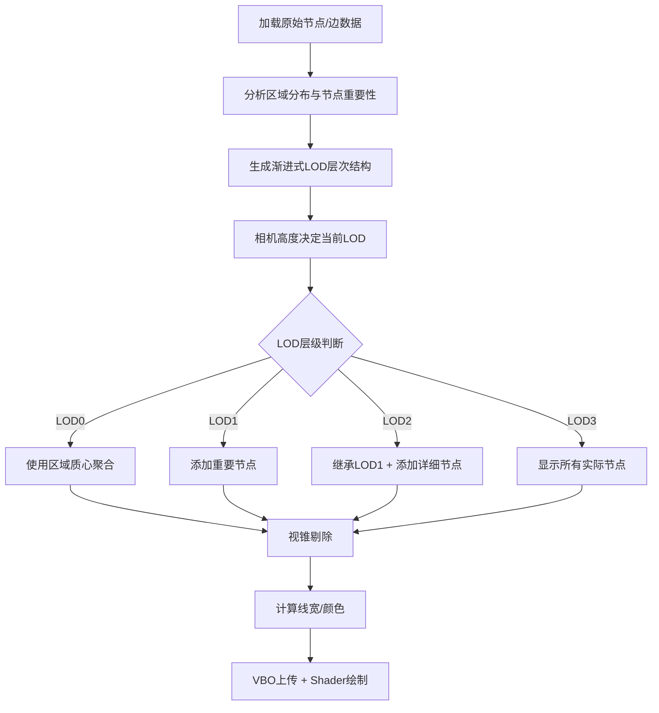

# 三维图布局系统改进方案（最终版）

**目标周期**：2天完成核心功能开发（LOD、聚合、视锥剔除、视觉设计）  
**适用系统**：基于 OSG 3.4.0 的三维可视化系统  

---

## 一、优化目标与范围

本次改进专注于以下核心模块的设计与实现：

| 模块代号 | 模块名称                  | 主要目的                                          |
|----------|---------------------------|---------------------------------------------------|
| A        | 渐进式LOD分层管理          | 按视角与尺度分层显示节点与边，实现视觉连续性       |
| B        | 边筛选与聚合策略          | 简化冗余连线，基于区域代表与质心展示全局网络流向   |
| C        | 视锥剔除与实时过滤        | 渲染视锥内节点与边，提升效率                       |
| D        | 线宽与颜色视觉设计        | 表达连接强度、流量等语义，增强可视化效果            |

---

## 二、详细设计

### 模块 A：渐进式LOD分层管理

#### 节点分层规则（基础）
| LOD层级 | 节点范围                  | 示例                                  |
|---------|---------------------------|---------------------------------------|
| LOD 0   | level == 0                | 全球核心枢纽节点（大洲级）            |
| LOD 1   | level ≤ 1                 | 区域中心节点（国家/区域中心城市）     |
| LOD 2   | level ≤ 2                 | 国家/省会节点                         |
| LOD 3   | level ≤ 3                 | 全部节点（完整细节）                   |

#### 🆕 渐进式LOD架构设计（核心改进）

**问题背景**：
原有LOD实现存在两个关键问题：

1. 生成的节点名称过长（如"China_Beijing_Tianjin"）
2. LOD层级切换时节点直接消失，缺乏视觉连续性

**渐进式LOD核心理念**：
- **LOD0→LOD1**：围绕原有节点渐进式扩展, 使用实际数据中的代表机场/城市
- **LOD1→LOD2**：使用实际数据中的代表机场/城市
- **视觉连续性**：用户能看到节点的渐进展开过程

##### 节点继承机制
```
LOD0: 基础代表节点 (少量区域中心)
LOD1: 区域重要节点 (扩展)  
LOD2: LOD1节点 + 详细实际节点 (继承 + 详细化)
```

##### 节点选择策略

**LOD0 (基础层)**：
- 少量区域中心代表点（计算的区域质心）
- 简化命名：`"N_America"`, `"Europe"`, `"Asia_East"`
- 每个区域1个代表节点

**LOD1 (扩展层)**：

- **新增**每个区域内最重要的实际节点
- 选择标准：`degree > 高阈值 && level <= 1` 的实际机场/城市
- 每个区域新增2-3个代表性节点

**LOD2 (详细层)**：
- **保留**LOD1的所有节点
- **新增**更多实际数据节点  
- 选择标准：`level <= 2 && degree > 中等阈值` 的所有机场
- 不再生成虚拟节点，全部使用实际数据

##### 边连接策略

**LOD0边**：
- 区域代表点间的聚合边
- 权重 = 该区域间所有实际边的权重和

**LOD1边**：

- 新增实际节点到区域代表点的连接
- 新增实际节点间的高权重边

**LOD2边**：
- 保留LOD1的所有边
- 新增所有符合条件的实际边

##### 渐进式LOD核心函数设计

主要函数generateGeographicLODData

```cpp
// 将主要生成逻辑拆分为函数
generateBaseLODNodes()              // 生成LOD0基础代表点
generateProgressiveLODNodes()       // 渐进式生成LOD1, LOD2
addLOD1Nodes()                     // 为LOD1添加实际重要节点  
addLOD2Nodes()                     // 为LOD2添加详细实际节点

// 辅助函数
simplifyRegionName()               // 简化区域名称
selectRepresentativeNodes()        // 从实际数据选择代表节点
calculateRegionCentroid()          // 计算区域质心
generateProgressiveEdges()         // 生成渐进式边连接
evaluateNodeImportance()           // 评估节点重要性（基于level和degree）
```

##### **实现逻辑流程**

1. **初始化**：
   - 从所有实际节点中分析区域分布
   - 计算每个区域的质心位置
   - 生成LOD0的简化代表节点
2. **LOD1生成**：
   - 在每个区域内选择degree最高的2-3个实际节点
   - 建立新节点与区域代表点的连接
3. **LOD2生成**：
   - 继承LOD1的所有节点  
   - 添加所有level<=2且degree>阈值的实际节点
   - 建立完整的实际边连接网络

##### 预期视觉效果

用户在缩放过程中将看到：
- **远距离**：少量简洁命名的区域代表点（如"N_America"）
- **中距离**：代表点保持不变，周围逐渐出现重要机场（如JFK、LAX）  
- **近距离**：所有重要节点都显示，形成完整的网络

> **与原方案区别**：
> - 原方案采用替换式LOD，新方案采用渐进式继承LOD
> - 新方案优先使用实际数据节点而非生成节点
> - 新方案简化了节点命名，提升用户体验
> - 新方案确保了视觉连续性和层次感

---

### 模块 B：边起止点与聚合策略

#### 起止点确定规则
| LOD层级 | 起止点定义                           | 说明                                 |
|---------|---------------------------------------|--------------------------------------|
| LOD 0   | 区域质心                             | 计算所有节点位置的加权平均（经纬度）    |
| LOD 1/2 | 区域内代表节点                        | 选择区域内最重要的节点（level最低、权重最高） |
| LOD 3   | 实际节点                             | 精确还原真实节点连线                    |

---

### 模块 C：视锥剔除与实时过滤

- 节点剔除：基于视锥包围盒，仅保留视锥范围内的节点。
- 边剔除：至少一个端点在视锥内则保留。
- 剔除时机：每帧相机更新时执行。

> **与原方案区别**：
> - 原方案提到性能问题但未有剔除方案。
> - 新方案明确引入视锥剔除，实现性能优化。

---

### 模块 D：线宽与颜色视觉设计

- 线宽 = `边权重` × `LOD缩放因子`
- LOD缩放因子：
  | LOD层级 | 缩放因子 |
  |---------|-----------|
  | LOD 0   | 1.5x      |
  | LOD 1   | 1.2x      |
  | LOD 2   | 1.0x      |
  | LOD 3   | 0.8x      |

- 颜色 = 全局统一色系（如黄绿色），根据权重微调明暗。

> **与原方案区别**：
> - 原方案中线宽未与LOD挂钩。
> - 新增LOD缩放因子设计。

---

## 三、处理流程总览（更新）



---

## 四、开发时间表（更新）

| 日期     | 模块   | 任务内容                                               |
|----------|---------|--------------------------------------------------------|
| 第一天   | A重构 + B | 实现渐进式LOD架构、节点继承机制、边起止点逻辑、聚合规则 |
| 第二天   | C + D   | 视锥剔除实现、线宽/颜色设计、Shader集成、整体调试     |

---

## 五、备注总结（更新）

- **🆕 渐进式LOD架构**：解决节点命名和视觉连续性问题
- **🆕 节点继承机制**：LOD层级间节点继承而非替换
- **🆕 实际数据优先**：优先使用真实机场/城市节点
- 边起止点（质心/代表节点）策略为新增
- 视锥剔除为新增
- 线宽/颜色设计与LOD挂钩为新增
- 原方案的基本渲染逻辑保留，LOD和边处理逻辑大幅更新

---

## 六、会话总结：渐进式LOD系统设计改进

### 会话主要目的
用户提出对三维图可视化系统LOD机制的两个关键问题，要求设计渐进式LOD解决方案以提升用户体验。

### 完成的主要任务
1. **问题诊断**：分析了原有LOD系统的两个核心问题
   - 生成节点名称过长
   - LOD切换时节点直接消失缺乏连续性

2. **渐进式LOD方案设计**：
   - 设计了节点继承机制（LOD0→LOD1→LOD2渐进扩展）
   - 制定了节点选择策略（优先使用实际数据节点）
   - 设计了边连接策略（保留上层边+添加细节边）

3. **技术文档更新**：将渐进式LOD设计集成到改进方案中

### 关键决策和解决方案

**设计决策**：
- 采用**继承式**而非**替换式**LOD架构
- **实际数据优先**：LOD1/2使用真实机场/城市节点
- **简化命名**：LOD0使用"N_America"等简洁区域名
- **视觉连续性**：用户看到节点渐进展开而非突然出现/消失

**核心解决方案**：
- `generateProgressiveLODNodes()`：实现渐进式节点生成
- `evaluateNodeImportance()`：基于degree和level评估节点重要性
- `ProgressiveNode`结构：支持节点继承和区域归属
- `LODHierarchy`架构：管理多层级节点数据

### 使用的技术栈
- **C++11**：满足代码标准要求
- **OSG 3.4.0**：三维图形渲染引擎
- **地理坐标系统**：经纬度坐标处理
- **图论算法**：节点重要性评估、区域聚类
- **LOD技术**：多层次细节管理

### 修改了哪些文件
1. **三维图布局系统改进方案v2.md**：
   - 在模块A中新增"渐进式LOD架构设计"章节
   - 更新模块B的聚合策略
   - 修改处理流程总览和开发时间表
   - 更新备注总结
   - 添加完整的会话总结记录

---


