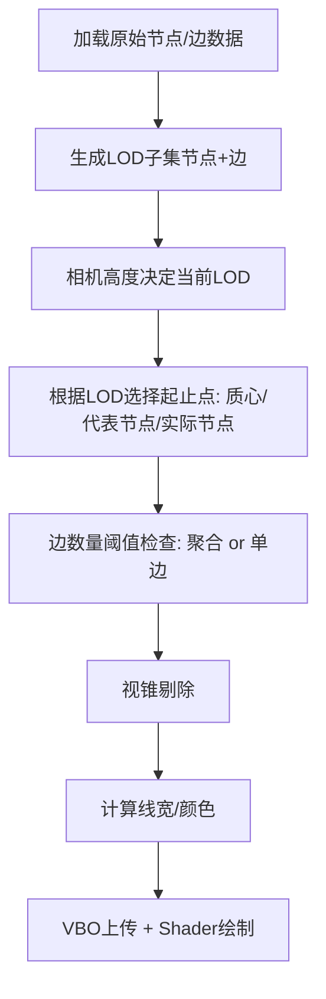

# 三维图布局系统改进方案（最终版）

**目标周期**：2天完成核心功能开发（LOD、聚合、视锥剔除、视觉设计）  
**适用系统**：基于 OSG 3.4.0 的三维可视化系统  

---

## 一、优化目标与范围

本次改进专注于以下核心模块的设计与实现：

| 模块代号 | 模块名称                  | 主要目的                                          |
|----------|---------------------------|---------------------------------------------------|
| A        | 节点与边的LOD分层管理      | 按视角与尺度分层显示节点与边，优化大数据渲染性能   |
| B        | 边筛选与聚合策略          | 简化冗余连线，基于区域代表与质心展示全局网络流向   |
| C        | 视锥剔除与实时过滤        | 渲染视锥内节点与边，提升效率                       |
| D        | 线宽与颜色视觉设计        | 表达连接强度、流量等语义，增强可视化效果            |

---

## 二、详细设计

### 模块 A：节点与边的LOD分层管理

#### 节点分层规则（预先给定）
| LOD层级 | 节点范围                  | 示例                                  |
|---------|---------------------------|---------------------------------------|
| LOD 0   | level == 0                | 全球核心枢纽节点（大洲级）            |
| LOD 1   | level ≤ 1                 | 区域中心节点（国家/区域中心城市）     |
| LOD 2   | level ≤ 2                 | 国家/省会节点                         |
| LOD 3   | level ≤ 3                 | 全部节点（完整细节）                   |

> **与原方案区别**：节点层级规则未变，但后续边的处理逻辑有大调整。

#### 边分层与筛选逻辑
| LOD层级 | 边筛选规则                           | 聚合策略                               |
|---------|----------------------------------------|-----------------------------------------|
| LOD 0   | 两端节点 level == 0                    | 使用区域质心生成粗线，表示区域间流量       |
| LOD 1   | 两端节点 level ≤ 1                      | 使用区域“代表节点”生成连接线，部分聚合     |
| LOD 2   | 两端节点 level ≤ 2                      | 使用代表节点连接，大部分显示真实边         |
| LOD 3   | 所有节点间的边                         | 完全展示，逐边绘制                        |

> **与原方案区别**：
> - 原方案边筛选主要基于节点level，没有起止点策略。
> - 新方案增加“质心/代表节点”的逻辑，实现更合理的边聚合。
> - LOD0强调全球流向，LOD1/2强调区域聚合。

---

### 模块 B：边起止点与聚合策略

#### 起止点确定规则
| LOD层级 | 起止点定义                           | 说明                                 |
|---------|---------------------------------------|--------------------------------------|
| LOD 0   | 区域质心                             | 计算所有节点位置的加权平均（经纬度）    |
| LOD 1/2 | 区域内代表节点                        | 选择区域内最重要的节点（level最低、权重最高） |
| LOD 3   | 实际节点                             | 精确还原真实节点连线                    |

> **新增设计**：此模块为全新补充，用于解决“粗线如何绘制”的问题，原方案未涉及。

---

### 模块 C：视锥剔除与实时过滤

- 节点剔除：基于视锥包围盒，仅保留视锥范围内的节点。
- 边剔除：至少一个端点在视锥内则保留。
- 剔除时机：每帧相机更新时执行。

> **与原方案区别**：
> - 原方案提到性能问题但未有剔除方案。
> - 新方案明确引入视锥剔除，实现性能优化。

---

### 模块 D：线宽与颜色视觉设计

- 线宽 = `边权重` × `LOD缩放因子`
- LOD缩放因子：
  | LOD层级 | 缩放因子 |
  |---------|-----------|
  | LOD 0   | 1.5x      |
  | LOD 1   | 1.2x      |
  | LOD 2   | 1.0x      |
  | LOD 3   | 0.8x      |

- 颜色 = 全局统一色系（如黄绿色），根据权重微调明暗。

> **与原方案区别**：
> - 原方案中线宽未与LOD挂钩。
> - 新增LOD缩放因子设计。

---

## 三、处理流程总览

---

## 四、开发时间表

| 日期     | 模块   | 任务内容                                               |
|----------|---------|--------------------------------------------------------|
| 第一天   | A + B   | LOD数据生成、边起止点逻辑、聚合规则实现               |
| 第二天   | C + D   | 视锥剔除实现、线宽/颜色设计、Shader集成、整体调试     |

---

## 五、备注总结

- 边起止点（质心/代表节点）策略为新增。
- 视锥剔除为新增。
- 线宽/颜色设计与LOD挂钩为新增。
- 原方案的节点LOD、基本渲染逻辑保留，边的处理逻辑大幅更新。

---

提示词 1：实现模块 A (节点与边的LOD分层管理) 与模块 B (边起止点与聚合策略)
背景:
v2方案中的模块A（节点与边的LOD分层管理）的节点分层规则与v1基本一致，现有代码中的 GraphRenderer::initializeLODData 和 GraphRenderer::updateActiveLOD 已经根据 Node::level 实现了节点的LOD层级数据准备和切换。
模块A的关键新增在于边的聚合策略，以及模块B定义的边起止点规则。这两个模块紧密相关，主要目标是在LOD 0、1、2层级，根据“区域质心”或“区域代表节点”来聚合边，而不是直接绘制原始边。LOD 3则显示所有实际边。
目标文件:
vis4earth/graph_viser/graph_display.h: 可能需要定义新的数据结构来存储区域信息、质心、代表节点等。
vis4earth/graph_viser/graph_display.cpp:
修改 GraphRenderer::PerGraphParam::updateEdgeVBO() (或其数据准备阶段) 以根据LOD级别和聚合策略生成边的顶点数据。
可能需要新增帮助函数来计算区域质心、选择代表节点。
GraphRenderer::initializeLODData() 可能需要调整或其后处理步骤中进行区域划分。
具体任务:
"请基于v2方案，重构 GraphRenderer::PerGraphParam 中边的处理和绘制逻辑，以实现LOD 0、1、2层级的边聚合功能，并根据模块B的规则确定聚合边的起止点：
区域定义与识别 (模块B):
确定区域划分依据: v2方案未明确区域如何划分。可考虑以下方案：
方案一: 利用 Node::level。例如，所有 level == 0 的节点各自形成一个区域的“核心”或本身就是区域代表。或者，地理位置相近且 level 相同的节点群可以构成一个区域。
方案二: 利用v1中提到的DBSCAN聚类结果 (Node::cluster)。每个cluster可以视为一个区域。
请优先考虑基于 Node::level 的区域划分逻辑，因为它与LOD层级定义直接相关。
在 GraphRenderer::initializeLODData 完成后，或在 PerGraphParam 中，增加逻辑来处理节点，根据其 level (或其他选定标准) 将其归属到特定区域。可能需要一个数据结构来存储每个区域包含的节点列表。
区域质心计算 (模块B - LOD 0):
实现一个函数 calculateRegionCentroid(region_nodes_list)，输入一个区域内的节点列表。
该函数根据v2方案，计算这些节点位置的加权平均（经纬度，权重可以是 Node::degree 或其他业务权重），返回质心坐标。
区域代表节点选择 (模块B - LOD 1/2):
实现一个函数 selectRepresentativeNode(region_nodes_list)，输入一个区域内的节点列表。
该函数根据v2方案，选择区域内“最重要”的节点（例如，level 最低，若 level 相同则选择 degree 或 weight 最高的节点）作为代表节点，返回该代表节点的ID或引用。
修改 PerGraphParam::updateEdgeVBO() (或其数据准备逻辑 - 模块A & B):
获取当前LOD层级 (可通过 GraphRenderer::getCurrentLevel() 的结果，currentActiveLODLevel 成员变量)。
LOD 3 (完整细节):
保持现有逻辑，遍历 *(this->edges) (已由 updateActiveLOD 切换为当前LOD的边数据 lodEdgesData[3])，直接使用 edge.from 和 edge.to 节点的实际位置 (Node::pos) 来生成VBO数据。
LOD 0 (区域质心聚合):
当LOD为0时，遍历 lodEdgesData[0] 中的原始边（这些边已经满足两端节点 level == 0）。
对于每条原始边 e = (u, v):
获取节点 u 所属区域的质心 C_u (调用 calculateRegionCentroid)。
获取节点 v 所属区域的质心 C_v (调用 calculateRegionCentroid)。
生成一条聚合边 (C_u, C_v)。
聚合处理: 多条原始边可能映射到同一条聚合边 (C_u, C_v)。需要将这些原始边的权重累加到对应的聚合边上。使用 std::map<std::pair<osg::Vec3, osg::Vec3>, AggregatedEdgeInfo> 来存储和合并聚合边。
将最终的聚合边信息（起点、终点、聚合后权重）用于填充VBO。
LOD 1 & LOD 2 (代表节点聚合):
当LOD为1或2时，遍历对应 lodEdgesData[currentLOD] 中的原始边。
对于每条原始边 e = (u, v):
获取节点 u 所属区域的代表节点 R_u (调用 selectRepresentativeNode)。
获取节点 v 所属区域的代表节点 R_v (调用 selectRepresentativeNode)。
生成一条聚合边 (R_u.pos, R_v.pos)。
聚合处理: 类似LOD 0，合并映射到相同代表节点对的聚合边，累加权重。
将最终的聚合边信息用于填充VBO。
VBO填充调整: mVertexArray, mColorFromArray, mColorToArray, mWeightArray, mLineIDArray 需要根据聚合后的边进行填充。聚合边的颜色可以基于代表节点的颜色或一个预定义颜色。
数据结构:
考虑在 PerGraphParam 或 GraphRenderer 中添加成员来存储区域定义、计算出的质心、代表节点等，以便在 updateEdgeVBO 中访问。例如:
Apply to 三维图布局系统改进方案v...
边的筛选规则验证 (模块A):
双重检查 GraphRenderer::initializeLODData 中边的筛选逻辑。v2方案的边筛选规则（如LOD0为“两端节点 level == 0”）应与代码实现一致。当前代码 fromNodeIt->second.level <= currentMaxLevel && toNodeIt->second.level <= currentMaxLevel 对于 currentMaxLevel = 0 时等价于两端都是 level == 0。对于其他层级也类似。这部分可能不需要大改，重点是后续的聚合。
请优先实现LOD 3的无聚合路径，确保基础绘制正确，然后逐步实现LOD 2, 1, 0的聚合逻辑。"
提示词 2：实现模块 C (视锥剔除与实时过滤)
背景:
v2方案要求实现基于视锥的节点和边剔除，以提升渲染性能。当前代码中 GraphRenderer::frustumCulling 是一个空函数，虽然存在 EarthGridPartition 结构，但未被充分利用于剔除。节点和边的可见性当前主要由LOD层级和 Node::visible/Edge::visible 属性控制。
目标文件:
vis4earth/graph_viser/graph_display.h: 可能需要修改 Node 和 Edge 结构，或增加临时状态来标记视锥内/外。
vis4earth/graph_viser/graph_display.cpp:
实现 GraphRenderer::frustumCulling() 函数。
修改 GraphRenderer::cameraUpdate() 以调用 frustumCulling 并应用其结果。
修改 GraphRenderer::PerGraphParam::update() (包括 updateEdgeVBO 和旧的绘制逻辑) 以尊重视锥剔除的结果。
具体任务:
"请实现v2方案中定义的视锥剔除功能，并将其整合到现有的渲染流程中：
实现 GraphRenderer::frustumCulling():
输入: 该函数应能获取当前相机的视锥体 (view frustum planes or projection and view matrices)。param._camera 可以提供这些信息。
节点剔除:
遍历当前LOD层级下的所有节点 (lodNodesData[currentActiveLODLevel] 或 graphParam->nodes)。
对每个节点，获取其世界坐标 (Node::pos 转换到球面坐标，如 vec3ToSphere 函数)。
将其包围体（可以是点或一个小球体，基于 Node::size）与相机视锥进行碰撞检测。
标记视锥外的节点为不可见 (例如，设置一个临时的 bool isInFrustum 标志，或者直接修改 Node::visible，但需注意 Node::visible 可能也受其他逻辑控制)。
优化: 可以考虑使用 EarthGridPartition 结构进行粗筛，只对可能在视锥内的网格中的节点进行精确剔除。
边剔除:
遍历当前LOD层级下的所有边 (lodEdgesData[currentActiveLODLevel] 或 graphParam->edges)，特别是聚合后的边（如果模块A/B已实现）或原始边（如果模块A/B未实现或LOD3）。
对于每条边，检查其两个端点。如果至少一个端点在视锥内（根据节点剔除的结果），则保留该边，否则标记为不可见。
更新可见性状态: 函数执行完毕后，应有一套明确的节点和边的可见性状态供后续渲染使用。
整合到 GraphRenderer::cameraUpdate():
在 GraphRenderer::cameraUpdate() 中，于LOD切换逻辑 (updateActiveLOD) 之后，获取当前相机视锥参数 (例如 minLon, maxLon, minLat, maxLat 可能是从相机参数导出的2D视口范围，但真正的3D视锥剔除更佳)。
调用 frustumCulling() 函数，传递必要的参数。
cameraUpdate 后续的标签更新逻辑 (updateLabelLists, syncSceneGraph) 也应考虑视锥剔除的结果，只为视锥内的节点创建/更新标签。
应用于 GraphRenderer::PerGraphParam::update():
在 PerGraphParam::update() 中，当绘制节点和边（无论是旧的绘制方式还是新的 updateEdgeVBO）时，必须检查节点和边的最终可见性状态（结合LOD过滤和视锥剔除的结果）。
例如，在 updateEdgeVBO 准备顶点数据前，应跳过被视锥剔除的边。
在绘制节点几何体前，应跳过被视锥剔除的节点。
剔除时机:
确保视锥剔除逻辑在每次相机更新（位置或朝向改变）时执行，正如 cameraUpdate 的调用时机。
坐标系和转换:
注意节点位置 (Node::pos 通常是经纬度+高度) 和OSG世界坐标之间的转换 (如 vec3ToSphere )，确保视锥剔除在正确的坐标系下进行。OSG提供了视锥剔除相关的工具类，可以研究使用。
建议:
开始时可以先实现简单的包围球与视锥平面的剔除。
考虑性能，避免在剔除过程中进行昂贵的计算或频繁的内存分配。"
提示词 3：实现模块 D (线宽与颜色视觉设计)
背景:
v2方案对边的视觉表现提出了新的要求：线宽由“边权重 × LOD缩放因子”决定，颜色采用全局统一色系并根据权重微调明暗。这与当前v1/代码中的颜色插值和固定或仅基于权重的线宽不同。此模块主要影响Shader和VBO的准备。
目标文件:
vis4earth/graph_viser/graph_display.cpp:
修改 GraphRenderer::PerGraphParam::updateEdgeVBO() 以准备新的顶点属性或Uniforms (如LOD缩放因子、基础颜色、边权重用于颜色调整)。
修改 GraphRenderer::PerGraphParam::initEdgeShaders() (或直接修改shader字符串) 以更新顶点和片段着色器逻辑。
新的/修改的GLSL Shader代码。
具体任务:
"请根据v2方案的模块D，修改边的VBO/Shader渲染逻辑，以实现新的线宽和颜色视觉设计：
线宽实现:
LOD缩放因子定义:
在C++代码中（例如 PerGraphParam 或 GraphRenderer）定义LOD到缩放因子的映射关系：
LOD 0: 1.5x
LOD 1: 1.2x
LOD 2: 1.0x
LOD 3: 0.8x
传递给Shader:
方案一 (Uniform): 在 PerGraphParam::updateEdgeVBO() 中，根据当前LOD级别确定当前的 lodScaleFactor。将其作为一个 uniform float uLodScaleFactor; 传递给Shader。
方案二 (Attribute): 如果每条边可能属于不同的LOD（不太可能在当前聚合模型下），或者为了灵活性，可以将 lodScaleFactor 作为顶点属性传递。但Uniform更简单。
Shader修改 (Vertex Shader或Geometry Shader):
当前 mUseNewRenderer=true 路径的Shader不直接控制线宽（依赖 osg::LineWidth）。要实现动态线宽，需要：
使用Geometry Shader (GS): GS是实现动态屏幕空间线宽最灵活的方式。GS接收线段的两个顶点，根据 边权重 * uLodScaleFactor 计算所需线宽，并输出构成线的四边形带 (quad strip)。
修改 osg::LineWidth (如果不用GS): 如果坚持不用GS，可以在C++中，PerGraphParam::update() 里，为 mEdgeGeometry 的 StateSet 设置 osg::LineWidth 对象。其值可以根据平均权重和当前LOD因子计算，但这将是所有线的统一宽度，而不是逐边不同。v2要求线宽=边权重×LOD缩放因子，这暗示逐边宽度，因此GS是首选。
如果选择GS，vWeight 属性需要从VS传递到GS。
如果你决定继续使用 osg::LineWidth 并在C++中设置，那么在 PerGraphParam::update() 中，你需要根据当前LOD的 lodScaleFactor 和一个代表性的（或平均的）edge.weight 来计算线宽值，并更新 mEdgeGeometry->getOrCreateStateSet()->setAttributeAndModes(new osg::LineWidth(calculatedWidth), ...)。但逐边权重控制将丢失。
颜色实现:
全局统一色系: 在C++或Shader中定义一个基础颜色 (例如 const vec3 globalBaseColor = vec3(0.5, 0.8, 0.2); // 黄绿色示例)。
传递给Shader:
基础颜色可以作为 uniform vec3 uGlobalBaseColor; 传递。
边权重 (edge.weight) 需要作为顶点属性传递给片段着色器 (当前通过 vWeight 传递)。
Shader修改 (Fragment Shader):
移除当前 mix(vColorFrom, vColorTo, ...) 的颜色插值逻辑。
获取 uGlobalBaseColor 和 vWeight。
实现基于 vWeight 调整基础颜色明暗的逻辑。例如:
Apply to 三维图布局系统改进方案v...
确保 vWeight (来自 edge.weight) 的范围适合用于调整明暗。可能需要归一化或明确其预期范围。
PerGraphParam::updateEdgeVBO() 修改:
确保 edge.weight 被正确加载并传递到 mWeightArray。
如果选择通过Uniform传递 uLodScaleFactor 和 uGlobalBaseColor，在此函数中或其调用处设置这些Uniform的值。
Shader程序 (initEdgeShaders):
如果使用GS，需要添加Geometry Shader源，并将其链接到 mEdgeProgram。
修改顶点和片段着色器源码以接收新的Uniforms，传递必要的varying变量，并实现新的计算逻辑。
注意:
模块A/B中的聚合边也需要有权重（例如，原始边权重的总和或平均值），这个聚合后的权重将用于模块D的线宽和颜色计算。
如果采用Geometry Shader实现线宽，这将是对现有Shader结构的一个较大改动。如果希望避免GS的复杂性，并接受一定程度的简化（例如，线宽主要由LOD决定，权重只轻微调制或在几个离散档位中选择），可以考虑在C++中更新 osg::LineWidth 状态，但这与v2方案的“边权重 × LOD缩放因子”精确描述有出入。"
