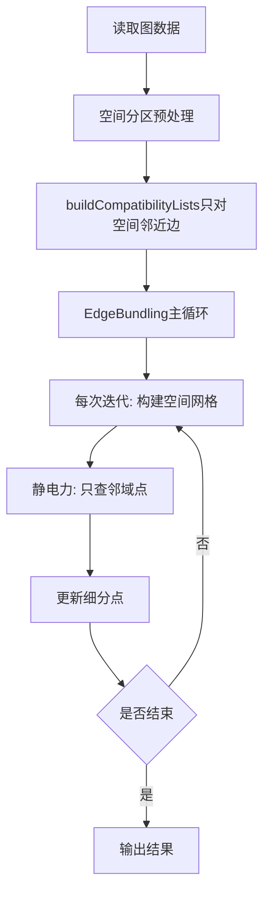

# 边绑定空间分区加速算法设计方案（优化版）

## 一、整体优化思路

- 针对**兼容边计算（buildCompatibilityLists）**和**主循环静电力计算**两大耗时环节，均引入空间分区（如均匀网格/四叉树）进行预筛选和加速。
- 兼容边计算时，先用空间分区筛选空间上接近的边，再计算兼容性，大幅减少O(E²)的边对数量。
- 主循环中，细分点插入空间网格，静电力只对邻域点计算，避免全局遍历。

---

## 二、类与函数设计

### 2.1 类成员变量与成员函数一览

| 类名        | 成员变量                                                                 | 成员函数                                                                                                 |
|-------------|--------------------------------------------------------------------------|----------------------------------------------------------------------------------------------------------|
| GridCell    | points: std::vector<std::pair<int, int>>                                | void addPoint(int edgeIdx, int subdivIdx)                                                               |
| SpatialGrid | grid: std::vector<std::vector<GridCell>><br>minX, minY, maxX, maxY: double<br>cellSize: double<br>rows, cols: int | SpatialGrid(double minX, double minY, double maxX, double maxY, double cellSize)<br>void insertPoint(int edgeIdx, int subdivIdx, const glm::vec3& pos)<br>std::vector<std::pair<int, int>> queryNeighbors(const glm::vec3& pos, double radius)<br>void clear()<br>void getCellIndex(const glm::vec3& pos, int& row, int& col) |

---

### 2.2 主要函数接口设计

| 函数名         | 所属类      | 返回值类型                              | 参数列表及类型                                                                 | 主要功能描述                                   |
|----------------|-------------|-----------------------------------------|--------------------------------------------------------------------------------|------------------------------------------------|
| addPoint       | GridCell    | void                                    | int edgeIdx, int subdivIdx                                                     | 向单元格添加一个细分点（边索引+细分点索引）     |
| insertPoint    | SpatialGrid | void                                    | int edgeIdx, int subdivIdx, const glm::vec3& pos                               | 插入细分点或边到对应网格单元                   |
| queryNeighbors | SpatialGrid | std::vector<std::pair<int, int>>        | const glm::vec3& pos, double radius                                            | 查询某点/边半径内的所有细分点/边               |
| clear          | SpatialGrid | void                                    | 无                                                                             | 清空网格，为新一轮迭代做准备                   |
| getCellIndex   | SpatialGrid | void                                    | const glm::vec3& pos, int& row, int& col                                       | 辅助函数，将坐标映射到网格索引                 |

---

### 2.3 代码结构示例

```cpp
class GridCell {
public:
    std::vector<std::pair<int, int>> points;
    void addPoint(int edgeIdx, int subdivIdx) {
        points.push_back(std::make_pair(edgeIdx, subdivIdx));
    }
};

class SpatialGrid {
public:
    SpatialGrid(double minX, double minY, double maxX, double maxY, double cellSize);
    void insertPoint(int edgeIdx, int subdivIdx, const glm::vec3& pos);
    std::vector<std::pair<int, int>> queryNeighbors(const glm::vec3& pos, double radius);
    void clear();
private:
    std::vector<std::vector<GridCell>> grid;
    double minX, minY, maxX, maxY, cellSize;
    int rows, cols;
    void getCellIndex(const glm::vec3& pos, int& row, int& col);
};
```

---

## 三、优化后主流程与兼容边计算流程

### 3.1 优化后主流程



### 3.2 buildCompatibilityLists 优化伪代码

```cpp
// 1. 用空间分区（如网格/四叉树）将边按起点/中点分组
for (每个网格单元) {
    for (单元内每对边) {
        计算兼容性
        if (兼容) 互为compatibleEdges
    }
}
```

### 3.3 主循环静电力计算优化伪代码

```cpp
SpatialGrid grid(minX, minY, maxX, maxY, cellSize);
// 1. 插入所有细分点
for (int edgeIdx = 0; edgeIdx < edges.size(); ++edgeIdx) {
    for (int subdivIdx = 0; subdivIdx < edges[edgeIdx].subdivs.size(); ++subdivIdx) {
        grid.insertPoint(edgeIdx, subdivIdx, edges[edgeIdx].subdivs[subdivIdx]);
    }
}
// 2. 查询邻域并计算作用力
for (int edgeIdx = 0; edgeIdx < edges.size(); ++edgeIdx) {
    for (int subdivIdx = 0; subdivIdx < edges[edgeIdx].subdivs.size(); ++subdivIdx) {
        auto neighbors = grid.queryNeighbors(edges[edgeIdx].subdivs[subdivIdx], radius);
        for (auto& neighbor : neighbors) {
            if (兼容) // 可选：进一步用兼容边表筛选
                // 计算作用力
        }
    }
}
```

---

## 四、主要优化点总结

1. **buildCompatibilityLists**
   - 用空间分区/包围盒/端点距离等预筛选，减少O(E²)的边对数量。
   - 可用多线程并行加速。

2. **静电力计算**
   - 用空间分区（网格/四叉树）加速邻域查询，避免全局遍历。
   - 兼容边+空间分区双重筛选，进一步减少无效计算。

3. **整体流程**
   - 先空间分区预处理，再分批/并行计算兼容边，主循环中每次迭代用空间分区加速邻域力计算。

---

## 五、说明
- 该优化方案适用于大规模稠密图，能显著提升兼容边计算和主循环效率。
- 设计易于实现和调试，主流程与原有算法解耦，后续可平滑升级为四叉树等更高效结构。
- 只需在每次迭代时构建一次网格，静电力计算时用邻域查询替换全局遍历。
